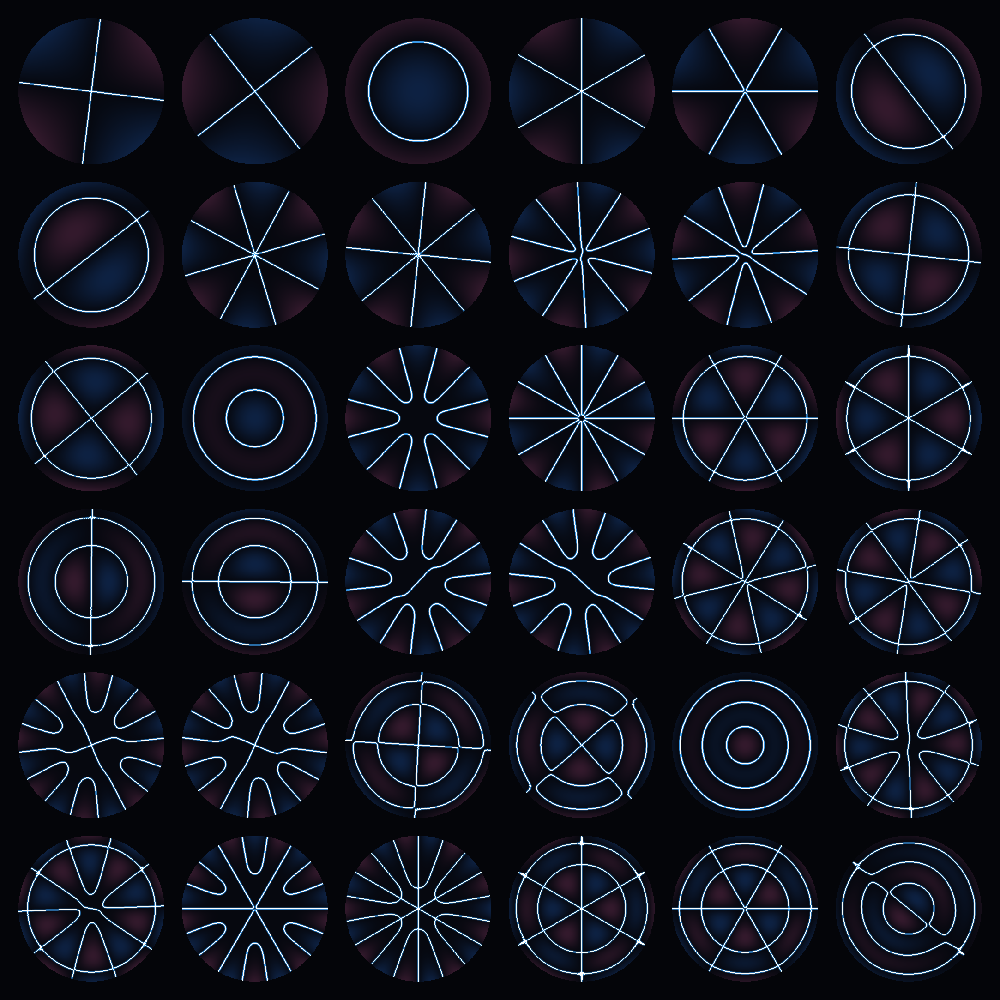

# chladni



Modal sound synthesis from surface meshes, built on a meshfree thin-shell
solver. A triangle mesh is interpreted as a thin shell (drum-shell, cymbal,
plate) of a chosen material and thickness; `chladni` assembles its
Kirchhoff–Love stiffness with one of three discretizations — **Loop
subdivision FEM**, **first-order local max-entropy (LME)**, or **second-order
max-entropy (SME)** — solves the generalized eigenproblem for the elastic
modes, projects a hammer impulse onto them, and renders the result as realtime
audio and a slow-motion mesh deformation with a Chladni nodal-line overlay.

## Pipeline

```
mesh.obj  +  IsotropicMaterial (E, nu, rho)  +  thickness h  +  loss factor eta
    │
    ▼
  thin-shell stiffness assembly  ── one of three formulations, behind a
    │                               single ShellAssembler interface:
    │
    ├─ LME / SME (default)   meshfree curved Kirchhoff–Love. Local
    │     max-entropy basis on a k-ring chart per node (Arroyo–Ortiz 2006);
    │     curved-shell bending strain (Millán–Rosolen–Arroyo 2011 §3.3);
    │     2nd-order graded-nodal-gap variant on by default
    │     (Rosolen–Millán–Arroyo 2013 §3.2.2). Ghost nodes on free edges.
    ├─ Loop                  Loop-subdivision FEM on the C¹ limit surface
    │     (Cirak–Ortiz–Schröder 2000), exact extraordinary-vertex evaluation
    │     (Stam 1999). Rejects meshes with boundary valence ∉ {2,3,4}.
    └─ legacy CST + IBM      constant-strain membrane + isometric bending
          (Grinspun 2003 / Wardetzky 2007); fallback only when Loop rejects.
    │
    ▼
  mass matrix M   consistent (or lumped) vertex masses → 3n × 3n sparse
    │
    ▼
  generalized eigenproblem     K φ = ω² M φ   (Spectra shift-invert,
    │                          multi-seed + Rayleigh–Ritz fusion to span
    │                          degenerate clusters; rigid-body modes filtered)
    ▼
  impulse projection           a_k = (φ_k · f / ω_k) · H_hammer · H_band
    │
    ▼
  resonator-bank synthesis     z_k(0) = (a_k, 0); z(t+dt) = z(t)·exp((-d+iω)dt)
    │                          sample = Σ_k Im(z_k); decoupled audio thread
    ├──► audio    (WAV via chladni::wav, realtime via miniaudio)
    └──► visual   (Polyscope: extruded shell, slow-motion deformation,
                   signed-normal amplitude overlay with isolines / nodal lines)
```

State is value-typed: material, mesh, and per-formulation parameters are plain
structs, and the eigensolve produces a self-contained mode bank with no
globals. The three formulations live behind `ShellAssembler`
(`include/chladni/shell/assembler.hpp`): the LME/SME basis and curved
Kirchhoff–Love assembly are in `src/shell/lme.cpp`, Loop subdivision in
`src/shell/loop.cpp` (with exact limit-surface evaluation in
`src/shell/loop_stam.cpp`), and dispatch plus the legacy CST+IBM fallback in
`src/shell/assembler.cpp`.

## Build

```sh
cmake -B build -DCMAKE_BUILD_TYPE=Release
cmake --build build -j
ctest --test-dir build --output-on-failure
```

The first configure fetches Eigen, Spectra, Catch2, tinyobjloader, and (if
`CHLADNI_BUILD_GUI=ON`, the default) Polyscope + miniaudio from source — no
system packages required. Polyscope's dependency tree (GLFW, glad, Dear ImGui,
glm, json) makes the first build take a few minutes; incremental builds touch
only the changed file. To build only the library + CLI demo:

```sh
cmake -B build -DCHLADNI_BUILD_GUI=OFF
```

API documentation (Doxygen, with `@cite` resolved against the bibliography):

```sh
cmake -B build -DCHLADNI_BUILD_DOCS=ON
cmake --build build --target docs
open build/docs/html/index.html
```

## Usage

Interactive GUI (Polyscope viewer + ImGui controls + miniaudio output) —
click the mesh to strike it; the resonator bank rings the modes out through the
audio device while the mesh deforms in slow motion:

```sh
./build/apps/strike_gui/strike_gui            # default mesh: models/cylinder.obj
./build/apps/strike_gui/strike_gui my.obj     # arbitrary OBJ (or drag-and-drop)
```

A **formulation TabBar** (Loop / LME / Legacy) selects the assembler at the top
of the control panel; the default is the **LME** tab with 2nd-order SME
enabled. The **Single-mode excitation** panel drives the textbook Chladni demo:
pick a mode index, press *Ring mode k*, and with damping near zero the nodal
isolines freeze into that mode's stationary Chladni figure.

CLI demo — loads a steel drum-shell cylinder, solves 30 free-free modes, and
writes a 2.5 s mono WAV:

```sh
./build/apps/synth_demo/synth_demo /tmp/drum.wav
afplay /tmp/drum.wav      # macOS — Linux: aplay / paplay
```

Headless tests (Catch2; every algorithm gated by an analytic or tabulated
reference):

```sh
./build/tests/chladni_tests               # 369 default cases
./build/tests/chladni_tests "[.slow]"     # the gated convergence sweeps
```

## Verification

Each discretization is checked against closed-form or tabulated shell results,
not just against the others. The summary below is the at-a-glance verdict; the
per-resolution numbers behind it are in [Method comparison](#method-comparison).

| Benchmark | Reference | Measured result |
|---|---|---|
| Free-edge disk, 7 Leissa modes (3 topologies) | Leissa 1969, NASA SP-160 | **LME 0.32–0.77 % max err** vs shipped Loop 3.5–7.0 % — meshfree ~8–11× more accurate at matched DOF on bending-dominated open shells; barely splits degenerate doublets the mesh cannot resolve |
| Closed icosphere, n=2 spheroidal pentet | Wilkinson 1965 / Duffey 2005 cubic | All three converge **O(h²)** through k=5 (Loop 0.83 → 0.03 %, LME 6.78 → 0.092 %, SME 3.94 → 0.067 %). Loop wins on smooth closed shells — lowest error at every level, and cheaper |
| Free–free cylinder, n=2 ovalling | Rayleigh–Love inextensional | The off-label regime — the source papers only test diaphragm ends. Loop flat **+4.2–4.5 %**; SME +6.1 %, rising to +18.7 % only at the most axially-coarse aspect (classical membrane locking, HF-confirmed); first-order LME locks, with spurious low modes inflating the lowest-mode average past +100 % |
| Scordelis–Lo roof | shell-obstacle-course, w/w_ref = 0.3024 | SME → **1.002** at 1089 V — converges to unity on this membrane-dominated benchmark |
| Geodesic pinched hemisphere, 18° hole | Millán 2011 Fig 17, δ/δ_ref = 0.0924 | Loop **cannot run** (boundary valence 5/6 unsupported); SME flat **~1.10** from the coarsest level — the mesh-independence counterexample |

## Method comparison

Per-resolution results behind the summary, across the three discretizations —
Loop subdivision FEM, first-order LME, and second-order SME (the default).
Bold marks the best method in each row.

**Free-edge disk — Leissa, 7 modes through (1,1), max relative error.**

| topology (V) | Loop (shipped) | LME | SME |
|---|---|---|---|
| polar 32×8 (257) | 6.52 % | **0.77 %** | 1.00 % |
| iso n=32 (117) | 7.03 % | **0.62 %** | 2.38 % |
| hex n=8 (211) | 3.54 % | **0.32 %** | 3.63 % |

Loop (shipped) is the `compute_shell_modes_loop` default — 7-pt Dunavant
quadrature with consistent mass; tuning across 6 quadrature×lumping configs
lowers it to a best-of-6 of 4.82 / 6.44 / 3.54 %, still well above LME. The
(2,0) doublet split on the symmetry-free iso disk is LME **0.010 %**, SME
0.027 %, Loop 0.39–0.58 % — meshfree barely splits a degenerate doublet the mesh
cannot resolve.

**Closed icosphere — Wilkinson n=2 spheroidal pentet, relative error.**

| k (V) | Loop (shipped) | LME | SME |
|---|---|---|---|
| 2 (162) | **0.83 %** | 6.78 % | 3.94 % |
| 3 (642) | **0.27 %** | 1.47 % | 0.96 % |
| 4 (2562) | **0.10 %** | 0.36 % | 0.26 % |
| 5 (10242) | **0.03 %** | 0.092 % | 0.067 % |

All three converge O(h²); meshfree starts 4–8× behind Loop at k=2 and closes
steadily — to 2.6× by k=4 and ~2× by k=5 (SME 0.067 % vs Loop 0.03 %) — but never
overtakes. Loop wins on smooth closed shells at every level. (The meshfree k=5 row
was initially unobtainable: the solve was OOM-killed at 30,726 DOF, which looked
like wide-stencil factorization fill but was in fact an assembly over-emission bug
— the curved assemblers emitted ~30–70× more triplets than nonzeros; fixed, k=5
now runs in ~3 GB. See the Weaknesses note.) "Shipped" Loop here uses the
multi-pass extraordinary-vertex path; the exact-evaluation Stam variant is
1.3–2.7× worse at every level.

**Free–free cylinder — Rayleigh–Love n=2 ovalling, 24×n_along, relative error.**

| aspect (V) | Loop | LME | SME |
|---|---|---|---|
| 2.39 (792) | **+4.2 %** | +172 % | +18.7 % |
| 1.59 (1176) | **+4.4 %** | +330 % | +8.8 % |
| 1.19 (1560) | **+4.5 %** | +116 % | +6.5 % |
| 1.01 (1848) | **+4.5 %** | +49 % | +6.1 % |

The off-label regime (the papers test diaphragm ends). The LME column is genuine
membrane locking *inflated* by spurious low modes contaminating the lowest-mode
average; SME's +18.7 % worst cell is the most axially-coarse aspect, easing to
+6.1 % as the grid isotropizes. Loop's C¹ basis sidesteps the locking — see
[Weaknesses](#weaknesses).

**Scordelis–Lo roof — w / w_ref (reference 0.3024), diaphragm ends.**

| V | Loop | LME | SME |
|---|---|---|---|
| 289 | **0.982** | 1.147 | 1.051 |
| 625 | 0.983 | 1.071 | **1.012** |
| 1089 | 0.984 | 1.039 | **1.002** |

Best = closest to the 1.0 target. SME converges to unity on this
membrane-dominated benchmark, overtaking Loop (which sits ~1.6 % low) by 625 V.

**Pinched hemisphere, 18° hole — δ / δ_ref (reference 0.0924), geodesic mesh.**

| V | Loop | LME (γ=0.8) | SME (α=2) |
|---|---|---|---|
| 142 | cannot run | 1.428 | **1.104** |
| 301 | cannot run | 1.301 | **1.121** |
| 516 | cannot run | 1.244 | **1.115** |
| 1125 | cannot run | 1.198 | **1.104** |
| 1969 | cannot run | 1.178 | **1.101** |

This is the paper's own Fig-17 discretization. Loop rejects every level — its
boundary stencil admits only valence-2/3/4 rim vertices, and the geodesic hole
rim carries valence-5/6 ones; the meshfree schemes are valence-agnostic. SME is
flat from the coarsest level (the Fig-17 character). On a degenerate lat-long
mesh (kept as a mesh-quality contrast) the same fixture runs Loop 0.607 → 1.073,
LME 2.297 → 1.325, SME 0.351 → 1.122 over 81 → 1089 V.

## Strengths

- **Free-edge fidelity.** On open bending-dominated shells the meshfree basis
  is sub-1 % against Leissa (LME 0.32–0.77 % across three disk
  topologies), versus 3.5–7.0 % for shipped Loop FEM at matched DOF — roughly
  8–11× more accurate.
- **Independent of mesh symmetry and connectivity.** Meshfree barely splits
  degenerate doublets a procedural mesh cannot resolve (iso-disk (2,0) split:
  LME 0.010 % vs Loop 0.39–0.58 %), and it runs the paper's own geodesic
  pinched hemisphere — where Loop's boundary stencil *rejects* the valence-5/6
  rim vertices outright. This is connectivity independence, not triangle-quality
  independence (see Weaknesses).
- **Faithfulness-audited.** Every numerical device that departs from the source
  papers is inventoried and justified, and the one invented feasibility net is
  *dormant* on all quality/clean meshes — its Newton-drop channel reads zero
  across the entire verification suite, so no benchmark cell rests on a
  non-paper mechanism.
- **Three formulations, one interface.** Loop / LME / SME (plus a legacy
  fallback) share a single `ShellAssembler`, so the same mesh and material can
  be re-solved under any discretization for direct comparison. The core library
  is graphics-free, and a Doxygen build with bibliography-resolved `@cite` tags
  is wired into CMake.

## Weaknesses

- **Sensitive to mesh quality (not symmetry).** On a low-quality triangulation
  — e.g. a consistent-diagonal quad mesh with valence-4/8 vertices and ~15°
  slivers — meshfree modal fields are 2–4× *rougher* than Loop, because Loop
  subdivides (low-pass-filters the control mesh) while the meshfree basis is
  evaluated on the actual vertices. The fix is remeshing, not a code change;
  "mesh independence" here means symmetry/connectivity, not element quality.
- **Membrane locking on thin curved shells — the classical shell-FEM regime.**
  On the free–free cylinder (the one setup the source papers never test — they
  use diaphragm ends), low-order elements lock in the inextensional limit,
  exactly the difficulty that MITC / reduced-integration shell elements exist
  to address. SME stays at +6.1 %, rising to +18.7 % only at the most
  axially-coarse aspect (genuine, Hellmann–Feynman-confirmed, not removable by
  chart choice); first-order LME locks harder, with spurious low modes
  inflating the lowest-mode average past +100 %. Loop's C¹ subdivision basis
  sidesteps it (flat +4.2–4.5 %) — this is the regime where, of the three, Loop
  is the right tool.
- **Cost profile.** A per-Gauss-point Newton solve on a k-ring chart is orders
  of magnitude slower than Loop's local subdivision rules — that assembly cost is
  intrinsic to the meshfree basis. (A former wall here, an OOM-kill of the
  meshfree eigensolve at icosphere k=5, turned out to be a *bug*, not the
  factorization: the curved assemblers emitted one block per node-pair per
  triangle in their shared support — a ~30–70× over-emission, ~196 M triplets for
  a 2.9 M-nonzero matrix — which spiked peak memory past 18 GB. Folding per-thread
  before emit cut k=4 from 12 GB to 0.5 GB and unblocked k=5 at ~3 GB.) The
  shift-invert factorization does become the binding cost around k=6, where a
  factorization-free eigensolver (LOBPCG / Jacobi–Davidson) would be the next
  step.
- **Legacy / unimplemented paths.** The CST + IBM path is retained only as a
  fallback for meshes Loop rejects. A solid (tet / 3D elasticity) mode is not
  implemented — genuinely absent, not abandoned.

## References

Meshfree max-entropy basis (the default formulation):

- Arroyo, M. and Ortiz, M. *Local Maximum-Entropy Approximation Schemes: A
  Seamless Bridge Between Finite Elements and Meshfree Methods.* Int. J. Numer.
  Methods Eng. 65(13):2167–2202, 2006. doi:10.1002/nme.1534. — the first-order
  LME basis.
- Millán, D., Rosolen, A., and Arroyo, M. *Thin Shell Analysis from Scattered
  Points with Maximum-Entropy Approximants.* Int. J. Numer. Methods Eng.
  85(6):723–751, 2011. doi:10.1002/nme.2992. — the curved Kirchhoff–Love
  bending-strain formulation on point sets.
- Rosolen, A., Millán, D., and Arroyo, M. *Second-Order Convex Maximum Entropy
  Approximants with Applications to High-Order PDE.* Int. J. Numer. Methods
  Eng. 94(2):150–182, 2013. doi:10.1002/nme.4443. — the second-order (SME)
  approximants and the graded nodal-gap feasibility recipe.

Subdivision-surface FEM:

- Cirak, F., Ortiz, M., and Schröder, P. *Subdivision Surfaces: A New Paradigm
  for Thin-Shell Finite-Element Analysis.* Int. J. Numer. Methods Eng.
  47(12):2039–2072, 2000. doi:10.1002/(SICI)1097-0207(20000430)47:12. — the
  Loop-subdivision shell elements.
- Stam, J. *Evaluation of Loop Subdivision Surfaces.* SIGGRAPH '99 Course
  Notes, 1999. — exact evaluation at extraordinary vertices.

Discrete-shells / legacy path:

- Grinspun, E., Hirani, A. N., Desbrun, M., and Schröder, P. *Discrete Shells.*
  SCA 2003, pp. 62–67. — the membrane + dihedral-bending energy.
- Wardetzky, M., Bergou, M., Harmon, D., Zorin, D., and Grinspun, E. *Discrete
  Quadratic Curvature Energies.* Computer Aided Geometric Design 24(8–9):
  499–518, 2007. doi:10.1016/j.cagd.2007.07.006. — the isometric bending model.
- Tamstorf, R. and Grinspun, E. *Discrete Bending Forces and Their Jacobians.*
  Graphical Models 75(6):362–370, 2013. doi:10.1016/j.gmod.2013.07.001. — the
  closed-form analytic bending Hessian.

Analytic references for the verification benchmarks:

- Leissa, A. W. *Vibration of Plates.* NASA SP-160, 1969. — circular / annular
  free-edge plate frequencies.
- Leissa, A. W. *Vibration of Shells.* NASA SP-288, 1973. — cylindrical and
  spherical shell frequencies.
- Wilkinson, J. P. *Natural Frequencies of Closed Spherical Shells.* J. Acoust.
  Soc. Am. 38(2):367–368, 1965. doi:10.1121/1.1909710.
- Duffey, T. A., Pepin, J. E., Robertson, A. N., and Steinzig, M. L.
  *Vibrations of Complete Spherical Shells with Imperfections.* LA-UR-04-6904,
  IMAC-XXIII, 2005. — restates the Wilkinson cubic in legible form.
- Vogel, S. M. and Skinner, D. W. *Natural Frequencies of Transversely
  Vibrating Uniform Annular Plates.* J. Appl. Mech. 32(4):926–931, 1965.
  doi:10.1115/1.3627337.
- Abramowitz, M. and Stegun, I. A. *Handbook of Mathematical Functions.* NBS
  Applied Mathematics Series 55, 1964. — Bessel-function approximations.

Modal sound synthesis:

- van den Doel, K. and Pai, D. K. *The Sounds of Physical Shapes.* Presence
  7(4):382–395, 1998. — the resonator-bank synthesis primitive.
- O'Brien, J. F., Shen, C., and Gatchalian, C. M. *Synthesizing Sounds from
  Rigid-Body Simulations.* SCA 2002, pp. 175–181. — the impulse → modal
  amplitudes → audio pipeline.
- Bonneel, N., Drettakis, G., Tsingos, N., Viaud-Delmon, I., and James, D.
  *Fast Modal Sounds with Scalable Frequency-Domain Synthesis.* ACM TOG (Proc.
  SIGGRAPH 2008) 27(3):24:1–24:9, 2008.

Tools and libraries (fetched at configure time):

- Guennebaud, G., Jacob, B., et al. *Eigen v3.*
  [eigen.tuxfamily.org](https://eigen.tuxfamily.org/) — dense and sparse linear
  algebra.
- Qiu, Y., et al. *Spectra.* [spectralib.org](https://spectralib.org/) — sparse
  generalized eigensolver.
- Sharp, N., et al. *Polyscope.* [polyscope.run](https://polyscope.run/) — the
  GUI viewer.
- *miniaudio* — realtime audio output. *tinyobjloader* — OBJ mesh loading.
  *Catch2* — the test framework.

## Layout

```
include/chladni/    public headers (Doxygen-commented)
src/shell/          the three thin-shell assemblers (lme, loop, assembler)
src/                synth, mass, eigensolve, mesh, wav
tests/analytical/   plate / shell closed-form tests
tests/shell/        FEM building blocks + the method-comparison fixtures
tests/unit/         OBJ loader, synth, WAV writer
apps/synth_demo/      CLI: mesh → WAV
apps/strike_gui/      interactive: click-to-strike (Polyscope + miniaudio)
apps/chladni_figures/ headless: render the 6×6 nodal-pattern contact sheet
docs/papers/          references.bib — bibliography for the Doxygen @cite tags
images/               the rendered hero figure
models/               test meshes (cylinder.obj, torus.obj)
```

## License

Free for personal, academic, and research use. No warranty. No commercial use.